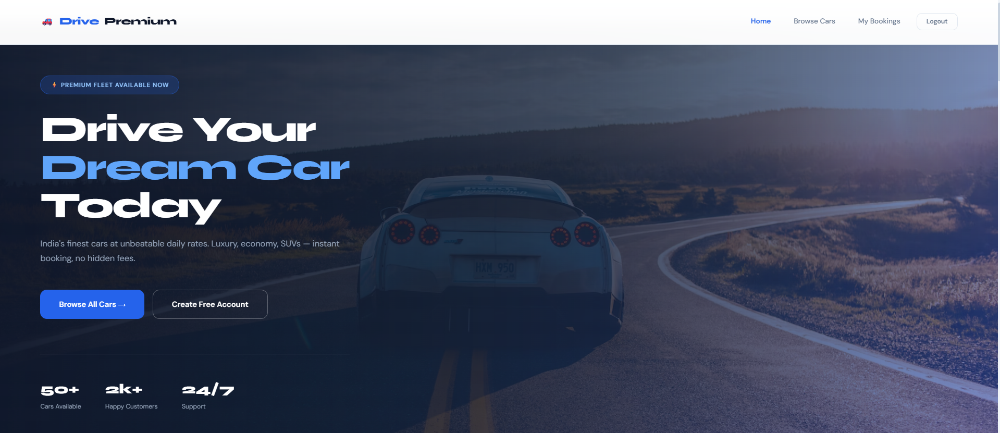
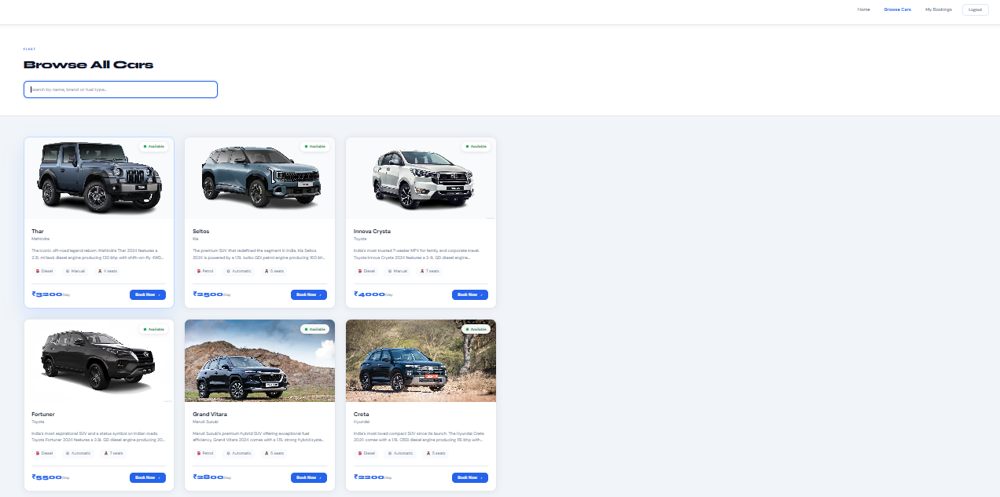
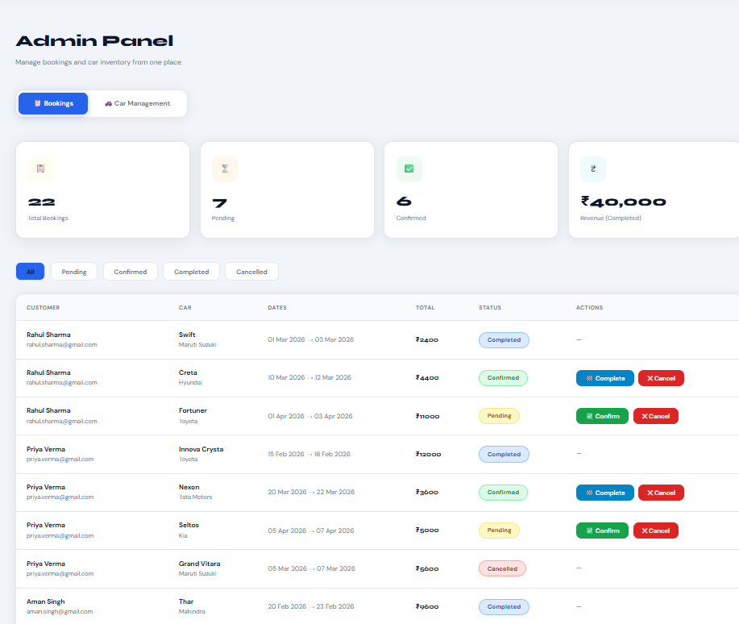

<div align="center">


<br/><br/>

# 🚗 DrivePremium
### Online Car Rental Management System

**A full-stack MERN web application for managing car rentals online.**  
Built as a Final Year BCA Project | Post Graduate Government College, Sector-11, Chandigarh

</div>

---

## 📌 Project Overview

**DrivePremium** is a fully functional online car rental management system that allows users to browse available cars, make date/time-based bookings, and manage their rentals — all through a clean, responsive web interface.

The system includes separate panels for **users** and **admins**, with features like Google OAuth login, JWT-based authentication, Cloudinary image hosting, and a real-time booking management dashboard.

---

## ✨ Features

### 👤 User Panel
- Register / Login with Email & Password
- Login with **Google OAuth 2.0**
- Browse all available cars with images and details
- Book a car by selecting **pickup & return date/time**
- View and manage personal booking history
- Cancel existing bookings

### 🛠️ Admin Panel
- Secure admin login with role-based access
- Add, edit, and delete car listings
- Upload car images via **Cloudinary**
- View all bookings across all users
- Manage booking statuses — Approve / Reject / Complete
- Dashboard with booking and fleet statistics

### 🔐 Authentication & Security
- JWT-based session management
- Google OAuth 2.0 via Passport.js
- Role-based route protection (User vs Admin)
- Tokens stored in localStorage and sent with every protected request

---

## 🛠️ Tech Stack

| Layer          | Technology                              |
|----------------|-----------------------------------------|
| Frontend       | React.js, React Router, Axios           |
| Backend        | Node.js, Express.js                     |
| Database       | MongoDB Atlas (Mongoose ODM)            |
| Authentication | JWT, Passport.js, Google OAuth 2.0      |
| Image Hosting  | Cloudinary                              |
| Styling        | CSS3, Responsive Design                 |
| Deployment     | Render (Backend), Local (Frontend)      |

---

## 📁 Project Structure

```
car-rental-management-system/
├── client/                  # React Frontend
│   ├── public/
│   └── src/
│       ├── components/      # Reusable UI components
│       ├── pages/           # Route-level pages
│       ├── context/         # Auth context (global state)
│       └── App.js
│
└── server/                  # Node/Express Backend
    ├── models/              # Mongoose schemas (User, Car, Booking)
    ├── routes/              # API route handlers
    ├── controllers/         # Business logic
    ├── middleware/          # JWT auth middleware
    ├── config/              # Passport & DB config
    └── server.js            # Entry point
```

---

## ⚙️ Installation & Setup (Local)

### Prerequisites
- Node.js v16+
- MongoDB Atlas account or local MongoDB instance
- Cloudinary account
- Google OAuth credentials (via Google Cloud Console)
- Git

### Step 1 — Clone the Repository
```bash
git clone https://github.com/yamanmittal04/car-rental-management-system.git
cd car-rental-management-system
```

### Step 2 — Setup Backend
```bash
cd server
npm install
```

Create a `.env` file inside the `server/` folder:
```env
PORT=5000
MONGO_URI=your_mongodb_connection_string
JWT_SECRET=your_jwt_secret_key
SESSION_SECRET=your_session_secret

# Google OAuth
GOOGLE_CLIENT_ID=your_google_client_id
GOOGLE_CLIENT_SECRET=your_google_client_secret
GOOGLE_CALLBACK_URL=http://localhost:5000/api/auth/google/callback

# Cloudinary
CLOUDINARY_CLOUD_NAME=your_cloudinary_cloud_name
CLOUDINARY_API_KEY=your_cloudinary_api_key
CLOUDINARY_API_SECRET=your_cloudinary_api_secret
```

> ⚠️ Never commit your `.env` file. It is already listed in `.gitignore`.

Start the backend:
```bash
npm run dev
```

### Step 3 — Setup Frontend
```bash
cd ../client
npm install
npm start
```

### Step 4 — Open in Browser
```
http://localhost:3000
```

---

## 🔗 API Endpoints

### Auth — `/api/auth`
| Method | Endpoint | Description |
|--------|----------|-------------|
| POST | `/register` | Register a new user |
| POST | `/login` | Login with email & password |
| GET | `/google` | Initiate Google OAuth login |
| GET | `/google/callback` | Google OAuth callback |

### Cars — `/api/cars`
| Method | Endpoint | Description |
|--------|----------|-------------|
| GET | `/` | Get all available cars |
| GET | `/:id` | Get a specific car by ID |
| POST | `/` | Add new car with image (Admin) |
| PUT | `/:id` | Update car details (Admin) |
| DELETE | `/:id` | Delete a car (Admin) |

### Bookings — `/api/bookings`
| Method | Endpoint | Description |
|--------|----------|-------------|
| POST | `/` | Create a new booking |
| GET | `/my` | Get logged-in user's bookings |
| GET | `/` | Get all bookings (Admin) |
| PUT | `/:id` | Update booking status (Admin) |
| DELETE | `/:id` | Cancel a booking |

---

## 🔐 Authentication Flow

```
User ──► Register/Login ──► JWT Issued ──► Stored in localStorage
                │
                └──► Google OAuth 2.0 (Passport.js)
                          │
                          └──► Callback ──► JWT Issued ──► Same flow
```

- Every protected API request carries the JWT in the `Authorization` header
- Admin routes are guarded by a role-check middleware on the server

---

## 🖥️ Screenshots

> _Add screenshots of your application here_

| Home Page | Car Listing | Admin Dashboard |
|-----------|-------------|-----------------|
|  |  |  |

---

## 👨‍💻 Developer

| Detail   | Info |
|----------|------|
| Name     | Yaman Mittal |
| Roll No. | 4011/23 |
| Course   | BCA (Final Year) |
| College  | Post Graduate Govt. College, Sector-11, Chandigarh |
| GitHub   | [@yamanmittal04](https://github.com/yamanmittal04) |

---

## 📄 License

This project was developed for educational purposes as part of the BCA Final Year curriculum.

---

<div align="center">
  Made with ❤️ for BCA Final Year Project 2026
</div>
